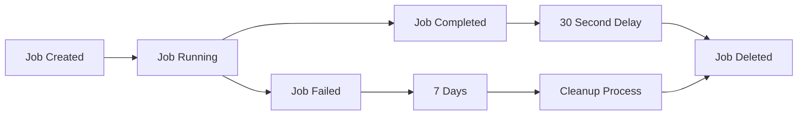
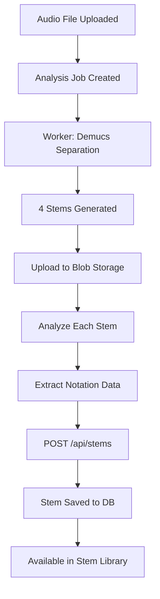

# Job Cleanup and Stem Library Implementation

## Overview
This document describes the automatic job cleanup system and stem library management implemented for the music analysis platform.

## ✅ Completed Features

### 1. **Automatic Job Cleanup**

#### Completed Jobs Auto-Deletion
- **Behavior**: Completed jobs are automatically deleted 30 seconds after completion
- **Purpose**: Keeps the jobs table clean while giving UI time to display completion status
- **Implementation**: `IdempotentJobService.CompleteJobAsync()` schedules background deletion

```csharp
// Jobs are completed and scheduled for deletion
await _jobService.CompleteJobAsync(jobId, metadata);
// After 30 seconds, job is automatically removed from database
```

#### Old Failed/Cancelled Jobs Cleanup
- **Method**: `CleanupOldJobsAsync(int daysOld = 7)`
- **Behavior**: Removes failed and cancelled jobs older than specified days (default: 7 days)
- **Usage**: Can be called manually or scheduled via background service

```csharp
// Clean up jobs older than 7 days
await _jobService.CleanupOldJobsAsync(7);
```

#### Stale Job Detection
- **Method**: `CleanupStaleJobsAsync()`
- **Behavior**: Marks jobs as stale if no heartbeat received for 30+ minutes
- **Automatic Retry**: Stale jobs can be automatically retried via idempotency system

### 2. **Stem Library Management**

#### Automatic Stem Saving
Stems are automatically saved to the database during analysis workflow:

1. **Analysis Worker** performs:
   - Source separation with Demucs (htdemucs model)
   - MIR analysis (BPM, key, beats, chords, sections)
   - Notation extraction (for drums, bass, guitar)
   - Audio quality metrics (RMS, peak, spectral centroid, zero-crossing rate)

2. **Worker Creates Stem Records** via API:
   ```http
   POST /api/stems
   Content-Type: application/json
   
   {
     "audioFileId": "guid",
     "type": "Drums",
     "blobUri": "https://...",
     "bpm": 120.5,
     "key": "C# major",
     "chordProgression": "[...]",
     "beats": "[...]",
     "sections": "[...]",
     "notationData": "{...}",
     "analysisStatus": "Completed",
     "...audio quality metrics..."
   }
   ```

3. **Stems are Stored** in database with complete metadata:
   - Musical analysis (BPM, key, time signature, tuning)
   - Audio quality metrics (RMS, peak levels, spectral features)
   - Structural information (chord progressions, beats, sections)
   - Notation data (for transcription features)
   - Analysis status tracking

#### Stem Types
The platform supports the following stem types (from Demucs separation):
- **Drums**: Percussion and rhythmic elements
- **Bass**: Bass guitar and low-frequency instruments
- **Vocals**: Lead and backing vocals
- **Other**: Guitar, keyboards, and other melodic instruments

#### Accessing Stem Library

**Get All Stems for Audio File:**
```http
GET /api/audio/{audioFileId}/stems
```

**Search Stems by Key:**
```http
GET /api/stems/key/{key}
```

**Search Stems by BPM Range:**
```http
GET /api/stems/bpm?minBpm=120&maxBpm=130
```

**Get Individual Stem:**
```http
GET /api/stems/{stemId}
```

**Stem Statistics:**
```http
GET /api/stems/stats
```

## Technical Implementation

### Job Lifecycle with Auto-Cleanup



### Stem Creation Flow



### Database Schema

**Stems Table:**
- `Id` (Guid): Primary key
- `AudioFileId` (Guid): Reference to source audio
- `Type` (StemType): Drums, Bass, Vocals, Other
- `BlobUri` (string): Cloud storage location
- `Bpm` (double?): Detected tempo
- `Key` (string?): Musical key (e.g., "C# major")
- `ChordProgression` (string?): JSON array of chords
- `Beats` (string?): JSON array of beat timestamps
- `Sections` (string?): JSON array of structural sections
- `NotationData` (string?): JSON containing musical notation
- `AnalysisStatus` (StemAnalysisStatus): Completed, Failed, etc.
- ...and many more audio quality and metadata fields

## Configuration

### Job Cleanup Timing

**Completed Jobs:**
- Auto-deletion delay: 30 seconds (hardcoded in `CompleteJobAsync`)

**Failed/Cancelled Jobs:**
- Default retention: 7 days
- Configurable via `CleanupOldJobsAsync(daysOld)` parameter

**Stale Job Detection:**
- Heartbeat timeout: 30 minutes (configurable in `CleanupStaleJobsAsync`)
- Running jobs without heartbeat for 30+ minutes are marked stale

### Stem Storage

**Blob Storage:**
- Container: `audio-files` (default)
- Path structure: `{audioFileId}/stems/{stemType}.wav`

**Database:**
- Table: `Stems`
- Cascade delete: Stems are deleted when parent AudioFile is deleted

## API Endpoints Summary

### Job Management
- `GET /api/jobs` - List all jobs
- `GET /api/jobs/{id}` - Get specific job
- `GET /api/jobs/stats` - Job statistics
- `DELETE /api/jobs/{id}` - Manual job deletion

### Stem Library
- `POST /api/stems` - Create stem (worker endpoint)
- `GET /api/stems/{id}` - Get specific stem
- `GET /api/stems/key/{key}` - Search by musical key
- `GET /api/stems/bpm?minBpm&maxBpm` - Search by BPM range
- `GET /api/stems/stats` - Stem library statistics
- `GET /api/audio/{id}/stems` - Get all stems for audio file

## Benefits

### 1. **Clean Job Management**
- ✅ Jobs don't clutter the database indefinitely
- ✅ UI shows completion status before cleanup
- ✅ Failed jobs retained for debugging (7 days default)
- ✅ Automatic retry for stale jobs

### 2. **Rich Stem Library**
- ✅ Every analyzed audio file contributes stems to the library
- ✅ Comprehensive metadata for music discovery
- ✅ Searchable by musical attributes (key, BPM, etc.)
- ✅ Ready for remixing, sampling, and music production features

### 3. **Production-Ready**
- ✅ Idempotent job processing prevents duplicates
- ✅ Automatic cleanup prevents database bloat
- ✅ Comprehensive error handling and logging
- ✅ Scalable architecture with background processing

## Future Enhancements

### Potential Improvements
1. **Background Scheduler**: Add Hangfire or Quartz.NET for scheduled cleanup jobs
2. **Stem Recommendations**: ML-based stem similarity search
3. **Stem Mixing**: API endpoints for creating new stems from library stems
4. **Batch Operations**: Bulk stem download/processing
5. **Stem Versioning**: Track different analysis versions of the same audio
6. **User Favorites**: Allow users to bookmark stems for quick access

## Monitoring

### Key Metrics to Track
- Number of completed jobs deleted per day
- Number of failed/cancelled jobs cleaned up
- Average job completion time
- Total stems in library
- Most popular stem types
- Library growth rate

### Logging
All job lifecycle events are logged with appropriate severity:
- `Information`: Job created, completed, deleted
- `Warning`: Job failed, marked as stale
- `Error`: Unexpected failures during cleanup

## Testing Recommendations

### Manual Testing
1. Create analysis job
2. Wait for completion
3. Verify job appears briefly in UI
4. Confirm job is deleted after 30 seconds
5. Verify stems are in database (`GET /api/audio/{id}/stems`)

### Automated Testing
1. Unit tests for `IdempotentJobService` cleanup methods
2. Integration tests for job lifecycle
3. API tests for stem creation and retrieval
4. Performance tests for large stem libraries

## Related Documentation
- [IDEMPOTENT_JOBS.md](./IDEMPOTENT_JOBS.md) - Idempotent job system details
- [WORKERS_COMPLETE_SUMMARY.md](./WORKERS_COMPLETE_SUMMARY.md) - Worker architecture
- [API_CONTROLLERS_SUMMARY.md](./API_CONTROLLERS_SUMMARY.md) - API endpoint reference
